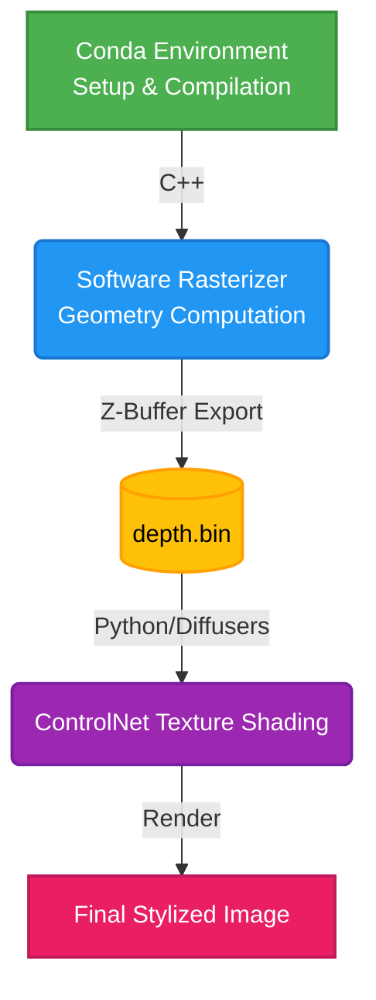

# Computer Graphics HW3 - Software Rasterization & Diffusion Shading

## Introduction
This project features a custom C++ based Software Rasterizer utilizing Z-buffer algorithms to render 3D scenes. The rendered results are seamlessly linked with a Python-based Stable Diffusion model suite (via ControlNet) to apply highly detailed and realistic texture shading over the raw rasterized geometries.

## Workflows
To resolve potential system conflicts between C++ graphic dependencies and modern Python AI libraries, we rely entirely on **Conda** for isolated environment management.



The operational workflow is divided into three major stages:
1. **Initialize**: Fetch all necessary C++ build tools, OpenGL libraries, and Pytorch/Diffusers dependencies via Conda.
2. **Execute C++ Engine**: Compile and run the C++ Graphics Engine to produce and export native depth map binaries.
3. **Execute Python Script**: Read the depth array, invoke the Stable Diffusion pipeline, and apply texture shading.

## Conda Environment Setting

### Quick Setting Steps

```bash
# 1. Create the environment from the configuration file
conda env create -f environment.yml

# 2. Activate the environment
conda activate your-env-name
```
*(PS: If you don't have a CUDA-enabled GPU or have version conflicts, please adjust the `pytorch-cuda` version in `environment.yml` accordingly)*

## Homework User Guideline
This is the guideline for the homework to show users how to compile, test, and view the final shading results.

### 1. Compile C++ rasterization program
```bash

cd hw3-rast

# Generate CMake build files
cmake -B build

# Compile the executable
make -C build
```

### 2. Execute rast.out and export geometries
When executed, this program will pop up a window comparing Hardware OpenGL (left) and our Custom Software Rasterization (right). Upon rendering the first frame, it will silently auto-export `opengl_depth.bin` and `software_depth.bin`.
```bash
# Run the executable
./build/rast
```

### 3. Execute Diffusion Model (Texture Shading)
Finally, trigger the Python script to read the binary depth maps and perform texture mapping using AI algorithms.
```bash
# Execute the shading script
HF_TOKEN="Your token" python diffusion_shading.py
```
*(Note: The first execution will download several gigabytes of pre-trained HuggingFace models. Once finished, you can inspect the visual results in outputs like `software_shaded_result.png`.)*

## Troubleshooting (Conda C++ Build Issues)

When using Conda to manage C++ graphics packages, you might encounter linking or compilation issues because Conda isolates your environment from system-level OpenGL libraries (`/usr/include/GL` and `/usr/lib/`).

**1. `fatal error: GL/gl.h: No such file or directory` or missing OpenGL library**
Ensure you have installed the required OpenGL provider packages within Conda:
```bash
conda install -c conda-forge mesalib libglvnd xorg-libxxf86vm
```
*(Note: These have already been added to the updated `environment.yml`.)*

**2. Linker Error `ld: cannot find -lOpenGL`**
Sometimes the provided Conda libraries compile correctly but the linker fails because the `.so` extensions map strictly to versioned files (like `libOpenGL.so.0`), which CMake avoids defaulting to without the raw `libOpenGL.so` symlink. If `make` fails with `-lOpenGL` missing, run the following to create the required symlinks inside your Conda environment:
```bash
# Navigate to your active Conda environment's lib folder
cd $CONDA_PREFIX/lib

# Create missing unversioned symlinks for the Linker
ln -sf libOpenGL.so.0 libOpenGL.so
ln -sf libGL.so.1 libGL.so

# if pillow has problem , using so.6 soft link so.5
ln -sf libtiff.so.6 libtiff.so.5
 
```
Then re-run `make` inside your `build` directory.
